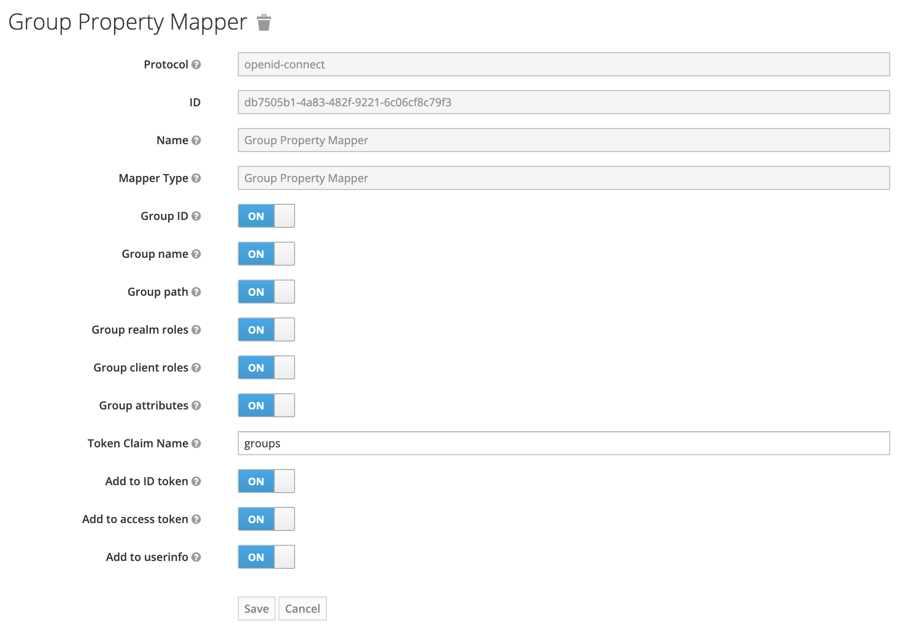

# Keycloak OIDC protocol token Group mapper

This token mapper allows for the mapping of user group data into the token. It
includes granular control of what properties from the group object you want to
map.



## Installation

Installation of the plugin consists of obtaining the `.jar` file and doing
one of the following:

1. **Quarkus** - copy the `.jar` into your `providers` directory.
2. **WildFly** - copy the `.jar` into your `standalone/deployments` directory.

Then rebuild/restart keycloak.

#### Download The `.jar`

Each GitHub release has the build artifact uploaded to it. You can manually
download it and install it by going to the Release and downloading the artifact.

If you want to automate it you can do the following:

```sh
export VERSION=some_version
wget "https://github.com/5-stones/keycloak-group-tokenmapper/releases/download/v$VERSION/com.weare5stones.keycloak.tokenmapper-group-$VERSION.jar"
```

#### Clone And Build The `.jar`

1. Clone the repository
1. From the root of the repository run:
	```
	mvn clean install
	```

The built `.jar` will be available in the root of the `target` folder.

## Release

The standard release command for this project is:

```
yarn version
```

This command will:

1. Generate/update the Changelog
1. Bump the package version
1. Tag & pushing the commit

e.g.

```
yarn version --new-version 1.2.17
yarn version --patch // 1.2.17 -> 1.2.18
```

#### Why Yarn?

Why are we using yarn on a Java project? Because we have standard tooling around
Changelog generation and release based around `commitizen` and
`conventional-changelog`. And we do what we want.

## Contributing

See the [contributing guide](CONTRIBUTING.md) to learn how to contribute to the repository and the development workflow.
